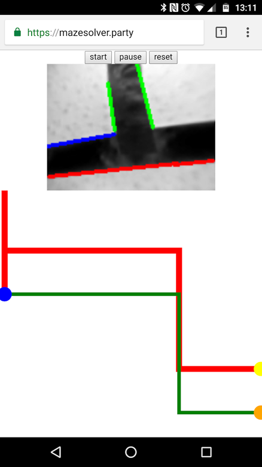

# opencv-mazesolver
A Raspberry Pi based robot with openCV that drives through a maze


We have also build a website for it where you can see the current camera image and the maze it has found.



## How to use
### Installation
#### Install these dependencies:
- python3
- opencv
- nginx
- simple-websocket-server
- rpi.gpio
- picamera
- ffmpeg
- janus
#### Setup
- move all the ```*.service``` files from ```scripts+services``` to ```/etc/systemd/systemd/```
- enable them wih ```sudo systemctl enable mazesolver autohotspot httpopencvstreamer```
- move ```nginx_mazesolver.conf``` to ```/etc/nginx/conf.d/```
### Run the program
- open your Pi's IP address or domain inside your web browser
- click the start button
