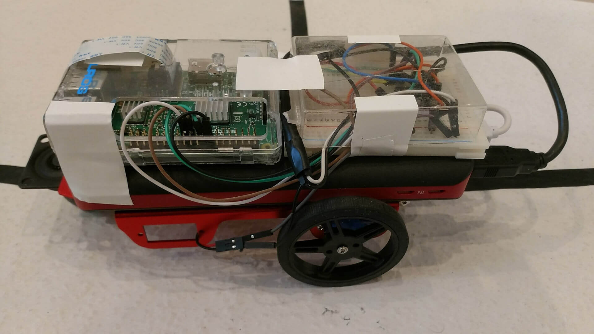

# opencv-mazesolver
A Raspberry Pi based robot with openCV that drives through a maze

## How to use
### Installation
#### Install these dependencies:
- python3
- opencv
- pyyaml
- apache2
- simple-websocket-server
- rpi.gpio
- picamera
- mjpg-streamer
#### Setup
- set up the path to your `src/httpdocs` folder inside the `/etc/apache2` directory
### Run the program
- run `python main.py` inside the `src` folder
- open your Pi's IP address inside your web browser

## sources
- [calibration procedure](https://github.com/tizianofiorenzani/how_do_drones_work/tree/master/opencv)
